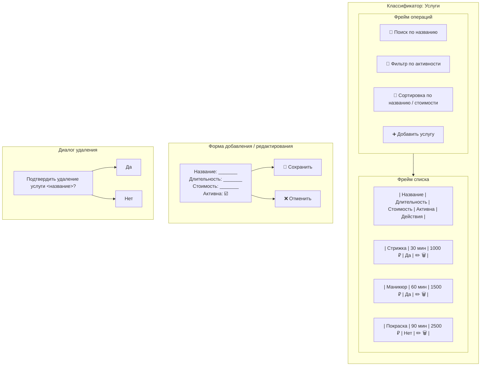

```mermaid
flowchart TB
    subgraph A["Классификатор: Услуги"]
        direction TB
        
        subgraph Ops["Фрейм операций"]
            Search[🔎 Поиск по названию]
            Filter[🔽 Фильтр по активности]
            Sort[🔼 Сортировка по названию / стоимости]
            Add[➕ Добавить услугу]
        end
        
        subgraph List["Фрейм списка"]
            T["| Название | Длительность | Стоимость | Активна | Действия |"]
            R1["| Стрижка | 30 мин | 1000 ₽ | Да | ✏️ 🗑️ |"]
            R2["| Маникюр | 60 мин | 1500 ₽ | Да | ✏️ 🗑️ |"]
            R3["| Покраска | 90 мин | 2500 ₽ | Нет | ✏️ 🗑️ |"]
        end
        
        Ops --> List
    end

    subgraph B["Форма добавления / редактирования"]
        Form[Название: _______\nДлительность: _______\nСтоимость: _______\nАктивна: ☑️]
        Save[💾 Сохранить]
        Cancel[❌ Отменить]
        Form --> Save
        Form --> Cancel
    end

    subgraph C["Диалог удаления"]
        DelQ["Подтвердить удаление услуги <название>?"]
        Yes[Да]
        No[Нет]
        DelQ --> Yes
        DelQ --> No
    end
```